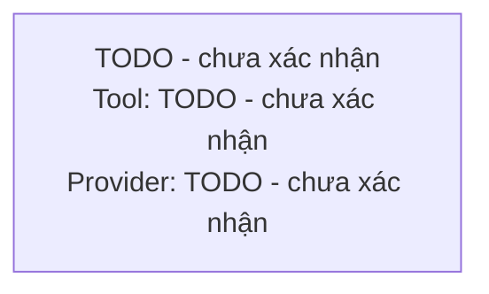

# Product Concept

This is the canonical source for the product, buyer, and promise.
Other files link here instead of copying those facts.

## Problem

State the costly current condition and its evidence.

## People and jobs

Describe affected people and the jobs they need to complete.
Separate the person who uses the product from the person who pays or decides to buy when they are different.
Include optional role lenses only when they were relevant in the interview.
The user, the developer, and the admin are not optional lenses, and each of them has a row in `## Surfaces and logic`.

## Proposed outcome

Describe the smallest useful product outcome without prescribing implementation.
Add a one-sentence promise using the customer's words from `client-note/` when available.

## Success measures

List measurable signals, baselines when known, and target direction.

## Scope

### In scope

### Out of scope

## Constraints

Cover time, budget, stack, compliance, operations, and other confirmed limits.

## Workflow and story map

This section is the input `/build:prototype` uses to choose spikes, so keep it at the step level and leave task-level decomposition to `/build:to-ticket`.

### Tools in use today

| Stakeholder | Tool or system | What they do in it | Must the product live here? | Still open |
|---|---|---|---|---|

### Story map

| Activity | Step | Actor | Trigger | Input | Output | Where it happens | UI/UX pattern | HITL | Still open |
|---|---|---|---|---|---|---|---|---|---|

### End to end flow

Use one actor subgraph as each swimlane, put the tool and provider in every node label, show every branch condition, draw HITL nodes with the person and allowed action, and style external systems separately.

### Human in the loop

| Step | Who decides | What they can do | What is blocked while waiting | What happens if they never act | Where the request reaches them |
|---|---|---|---|---|---|

## Surfaces and logic

Infer each stakeholder's surface from where their steps happen in the story map, then ask the user to confirm it instead of asking without context.
Record where each stakeholder does the work and how determined each capability must be, not which framework builds it.
`none` is a real answer and is different from an unanswered question.

| Stakeholder | Surface | Host product if Zero UI | Why | Still open |
|---|---|---|---|---|
| User |  |  |  |  |
| Developer |  |  |  |  |
| Admin |  |  |  |  |

Surfaces are Web/App and Zero UI, and one stakeholder may hold both.

### Logic levels

The four levels are plain code, workflow, skill, and agent.
They stack instead of excluding each other, so one capability may cross several of them.
Push work down to plain code wherever it fits, and keep an agent only where the input is genuinely open and cannot be predicted.

| Capability | Level | Why this level | Can it move down? |
|---|---|---|---|

### Data and technology

Describe what must outlive a session, who owns it, and anything already running that the product must reuse.
Name a technology only when the user actually chose it, and leave it open otherwise so `/build:prototype` can settle it with a spike.
Name every external system the product depends on, including the host product of any Zero UI surface.

## Risks and open decisions

Separate known risks from decisions that require a prototype.

## Nguồn

| Tư liệu | Loại | Câu hỏi đã trả lời | Kết luận được hỗ trợ |
|---|---|---|---|

Include one row for every analyzed artifact, repository source, or URL.
