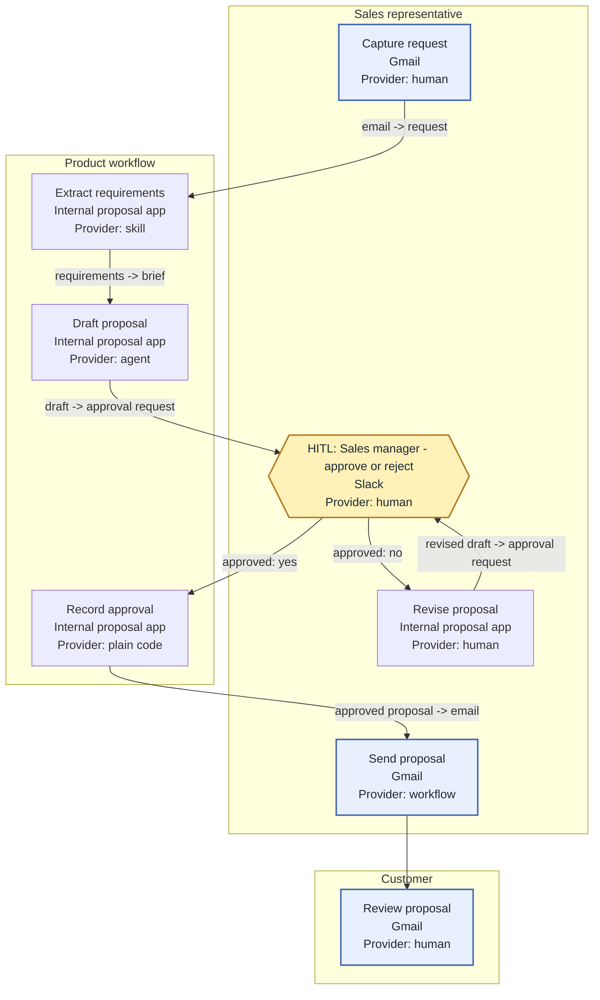

# Journey and workflow

## Why this exists

`/build:prototype` cannot choose the right spike without knowing the end-to-end steps, where a person must intervene, and the real tools where the work happens.
A surface and logic level alone can still produce a spike on the right host but at the wrong moment.

## Tool landscape today

Ask about the tools in use before mapping the journey.
A Zero UI answer must name its host product, and the existing tool landscape often reveals that host before the surface question is asked.
Use the named tools as evidence for [SURFACES-AND-LOGIC.md](SURFACES-AND-LOGIC.md), then confirm the inferred surface with the user.
Record real product names such as Google Sheets, Slack, Zalo, or an internal operations console instead of generic labels such as "spreadsheet" or "chat."

## Story map shape

Arrange backbone activities in time order from the trigger to the completed outcome.
Place the steps that deliver each activity beneath that activity.
Stop at the step level, where one row describes a meaningful user or system action with an input and an output.
Task-level decomposition belongs to `/build:to-ticket`.

## HITL taxonomy

Use one of these human-in-the-loop types when a step needs a person.

| Type | Meaning |
|---|---|
| Approve before effect | A person approves or rejects an action before it can take effect |
| Edit then continue | A person changes the proposed content or parameters, then lets the flow continue |
| Escalate or hand off | The system transfers ownership to a person or another responsible role |
| Spot-check after execution | The flow runs first and a person reviews samples or exceptions afterwards |
| No human | The step proceeds without a human decision or review |

Every HITL row must name who acts, what they can do, what remains blocked while waiting, what happens if they never act, and the tool through which the request reaches them.
A role name is enough when an individual has not been assigned, but an empty actor is not.

## UI/UX pattern vocabulary

Use this vocabulary to describe how a step appears to the person doing it: form, table + filter, wizard, inbox or queue, chat thread, notification + deeplink, sheet row, document, dashboard, or none.
Ask about the pattern only when it is not already evident from the named tool or when choosing the wrong pattern would be costly.
Do not turn the concept interview into screen-level design.

## Mermaid drawing convention

Draw one `flowchart TD` per journey and use one `subgraph` per actor as a swimlane.
Every step node label contains the step name, the tool or system where it happens, and the provider.
Use the provider vocabulary human, plain code, workflow, skill, and agent.
Label an edge with `input -> output` when the transformation matters.
Label every decision branch with its condition, including the negative branch.
Draw every HITL node with the `{{ }}` shape and label it `HITL: <who> - <approve|edit|reject|escalate>`.
Give HITL nodes their own `classDef`.
Give external systems that the team does not own a separate `classDef`.
Draw an unclear step instead of omitting it and label it `TODO - chưa xác nhận`.
Keep one diagram to one journey, and split it by backbone activity when it grows beyond about 20 nodes.

The following example is complete enough to preserve the tool, provider, reviewer, and both outcomes of the decision.

## Question shapes

Tool landscape:

> Which real tools or systems does each stakeholder use today, what do they do there, and must the product meet them inside any of those tools?

End-to-end journey:

> Starting with the event that triggers the work, walk me through each step until everyone agrees it is done.
> For each step, who acts, what goes in, what comes out, and where does it happen?

As-is and to-be:

> Which of those steps describe today's process, and what should change in the intended product journey?

HITL:

> At `<step>`, does a person approve before effect, edit then continue, receive an escalation or handoff, spot-check after execution, or not intervene?
> Who is that person, what can they do, what waits for them, what happens if they never act, and through which tool do they receive the request?

UI/UX pattern:

> At `<step>`, should the person work through a form, table + filter, wizard, inbox or queue, chat thread, notification + deeplink, sheet row, document, dashboard, or none?

## Recording rules

- An unanswered cell is `TODO - chưa xác nhận`.
- A HITL row without a named person or role is incomplete.
- "No human anywhere" is a real answer and must be recorded.
- A tool must use the real product name rather than a generic category.
- Never invent a step, tool, actor, reviewer, branch, or UI/UX pattern.
